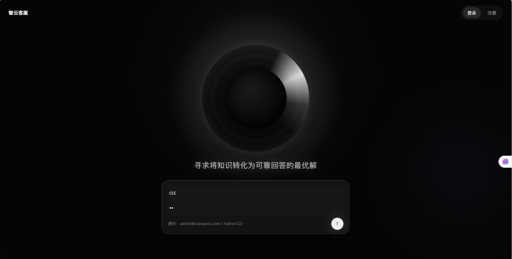
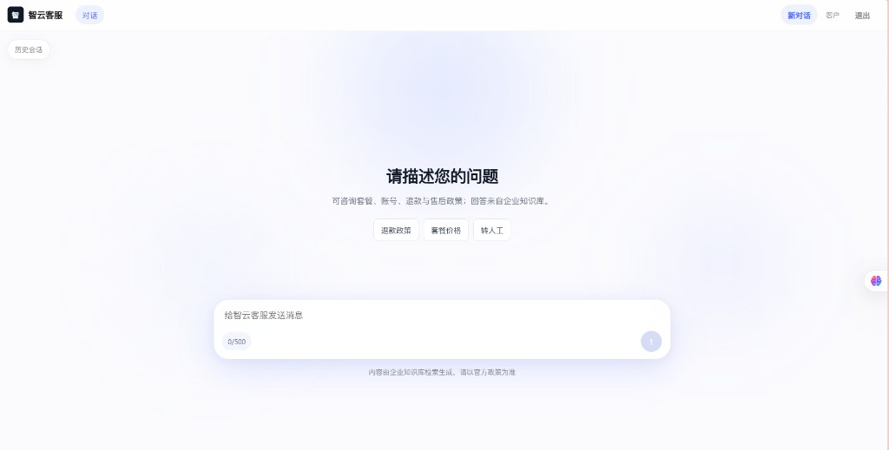
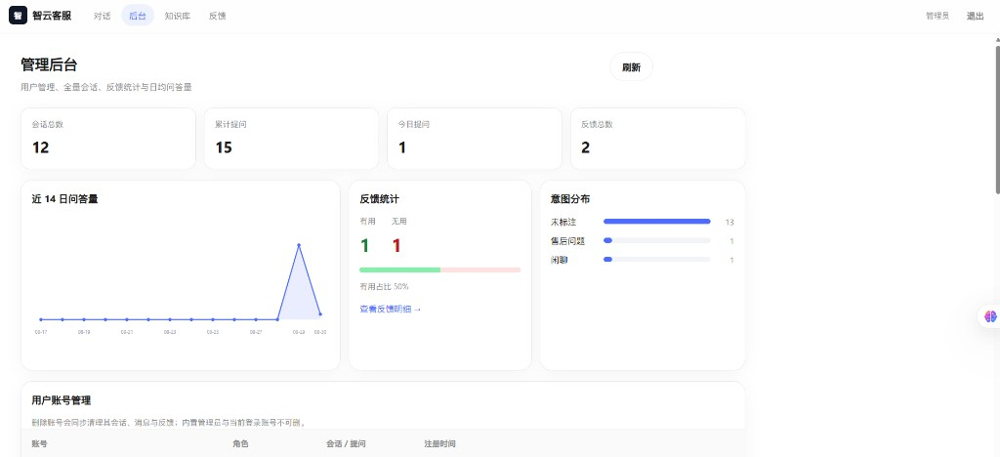

# 智云客服

基于企业知识库的智能客服系统：支持注册登录、多轮对话、文档知识库、检索增强回答（RAG）、流式输出、引用来源与管理后台。

仓库：https://github.com/marryme1314/zhiyunkefu

## 目录

| 路径 | 说明 |
|---|---|
| `backend/` | Spring Boot 3 / Java 17 |
| `frontend/` | Vue 3 + TypeScript + Vite |
| `docs/` | API、架构、库表、业务流程；`docs/screenshots/` 为运行截图 |
| `项目说明.md` | 技术选型与实现说明 |
| `运行指南.md` | 本机启动步骤 |
| `.env.example` | 环境变量模板（**不要**提交真实 `.env`） |

## 能做什么

- 用户注册 / 登录（邮箱或手机号）
- 会话管理与多轮问答
- 知识库文档上传、分区、删除（自动切分与向量化）
- 基于知识库检索生成回答，并展示参考资料
- SSE 流式输出，支持停止、重试、追问建议
- 回答点赞 / 点踩；管理员查看统计、会话与用户

## 运行截图

### 登录



### 对话



### 管理后台



## 快速启动（Windows）

1. 复制 `.env.example` 为 `.env`，填写 `MYSQL_*`、`JWT_SECRET`；使用月之暗面对话时填写 `MOONSHOT_API_KEY`
2. Docker 可用时双击 `初始化数据库.bat`（MySQL **3307** / `ai_cs` / `ai_cs_dev`）
3. 语义向量：安装并启动 Ollama，执行 `ollama pull nomic-embed-text`（或使用仓库内相关脚本）
4. 双击 `启动后端.bat`、`启动前端.bat`，或 `一键启动.bat`
5. 打开 http://localhost:5173  
   管理员：`admin@company.com` / `Admin123!`

也可用命令行：

```bash
cd backend && mvn spring-boot:run
cd frontend && npm install && npm run dev
```

## 技术说明

- 对话默认 Moonshot；也可切换本机 Ollama
- Embedding 优先 Ollama `nomic-embed-text`，不可用则回退本机词法向量
- 向量存 MySQL，进程内做余弦 Top-K 检索（适合中小规模知识库）

## 测试

```bash
cd backend && mvn test
```

## 安全

已忽略：`.env`、`tools/` 下便携运行时与下载包、`node_modules`、`target`。仅提交 `.env.example` 与少量 `tools` 辅助脚本。
