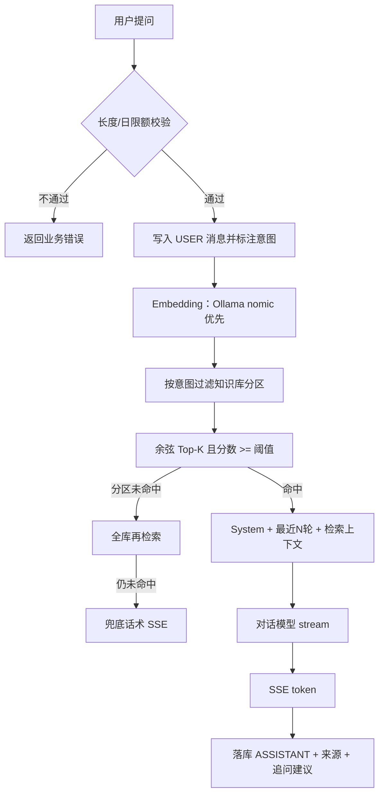

# AI 架构设计

## RAG 流程

## 意图

1. 短超时调用对话模型，要求只输出 `{"intent":"CODE"}`。
2. 解析失败则关键词规则：转人工 / 投诉 / 闲聊 / 超出范围 / 售后 / 产品 / 知识问答。
3. 投诉与售后的差异写在分类 Prompt 里：投诉偏问责与情绪，售后偏退换修与账号处理。

## Prompt

System：只根据知识库检索结果回答；禁止编造政策价格流程；资料不足时明确说不足。

用户侧最后一条含【知识库检索结果】与【用户问题】。多轮只追加最近 `history-rounds`（默认 3）轮原文。

## 向量策略

- 切分：400 字窗口、80 字重叠。
- Top-K：4。
- 阈值：词法向量用配置值（默认 0.18）；Ollama/Moonshot 语义向量不低于 0.28。
- 空结果：不调用 Chat。
- 存储：切片向量 JSON 存在 MySQL，启动加载到内存算余弦。当前语料规模较小；生产环境建议换向量库或 ANN 索引。

## Embedding 回退

`EMBED_PROVIDER=auto`：探测 Ollama `/api/embeddings` 成功则全程用 nomic（通常 768 维）；否则本机字符 n-gram 哈希（384 维）。启动时若库中向量维数与当前后端不一致，会重嵌全部就绪文档。

## 多知识库

文档字段 `kb_collection`。产品咨询优先 PRODUCT+FAQ；售后/投诉优先 AFTER_SALES+FAQ；其它意图全库。分区无结果则回退全库，避免分错库导致答不上。

## 异常

- Embedding 服务不可用：回退词法向量并打日志，不阻断启动。
- Chat 超时：504。
- 用户停止生成：中断 SSE，已生成内容落库并标记中断。
