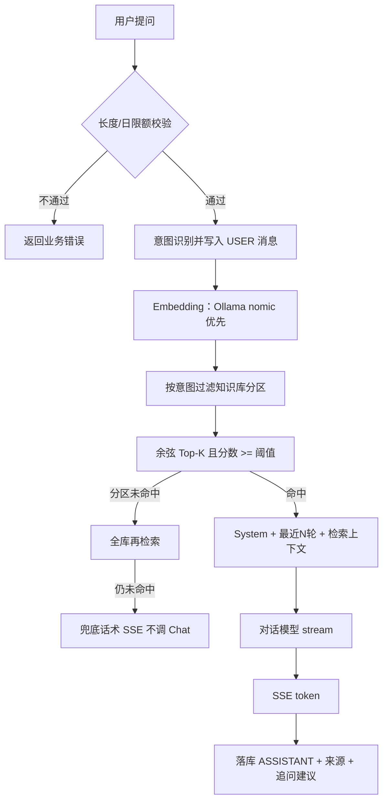

# AI 架构设计

## RAG 完整流程图



## Prompt 模板设计

### System Prompt（代码常量 `PromptBuilder.SYSTEM_PROMPT`）

```text
你是企业智能客服助手。你必须严格依据【知识库检索结果】回答用户问题。
规则：
1. 不要编造知识库中不存在的政策、价格、流程或承诺。
2. 如果检索结果不足以回答，明确说明资料不足，并建议联系人工客服。
3. 回答简洁、礼貌，使用中文。
4. 不要输出与问题无关的内容。
```

### 如何拼接上下文与检索结果

发给 LLM 的 messages 顺序：

1. `role=system`：上面的 System Prompt  
2. 最近 `history-rounds`（默认 3）轮的 `user` / `assistant` 原文（不含当前问题）  
3. 最后一条 `role=user`：由 `PromptBuilder.buildUserPrompt` 生成，形如：

```text
【知识库检索结果】
[1] 来源文档: 公司产品介绍.txt（相似度 0.812）
……切片正文……

[2] 来源文档: …
……

【用户问题】
专业版怎么收费？
请仅根据以上检索结果作答。
```

投诉/售后等意图还会在该 user 消息前增加一行意图提示（如「请先表达歉意与共情」），引导语气，但仍要求依据资料。

## 向量检索策略

| 参数 | 取值 | 原因 |
|---|---|---|
| 切分 | 400 字窗口 / 80 字重叠 | 中文条款易被切断，重叠保留上下文 |
| Top-K | 4 | 种子语料约数千字；K 过大易引入无关段落抬高幻觉风险 |
| 相似度阈值 | 配置默认约 0.18；语义 Embedding（Ollama）时不低于 0.28 | 过滤「看起来有点像但无关」的切片；空命中宁可不答 |
| 空结果 | **不调用** Chat | 防幻觉 |
| 短问兜底 | 阈值未命中时用原文 `contains` | 「退款」等极短问向量分可能偏低 |
| 存储形态 | MySQL `embedding_json` + 进程内余弦 | 体量小、部署简单；生产可换 Faiss/Chroma 而不改 RAG 逻辑骨架 |

## 意图与多知识库

- 意图：LLM JSON 优先，失败则关键词规则。  
- 分区：`PRODUCT` / `AFTER_SALES` / `FAQ` / `GENERAL`；产品咨询优先产品+FAQ，售后/投诉优先售后+FAQ，未命中再全库。

## Embedding 回退

`EMBED_PROVIDER=auto`：Ollama 可用则用 nomic；否则本机词法向量。进程内锁定后端，维数变化时启动重嵌。

## 异常

- Embedding 不可用：回退词法向量。  
- Chat 超时：504。  
- 用户停止：中断 SSE，已生成内容落库并标记中断。
