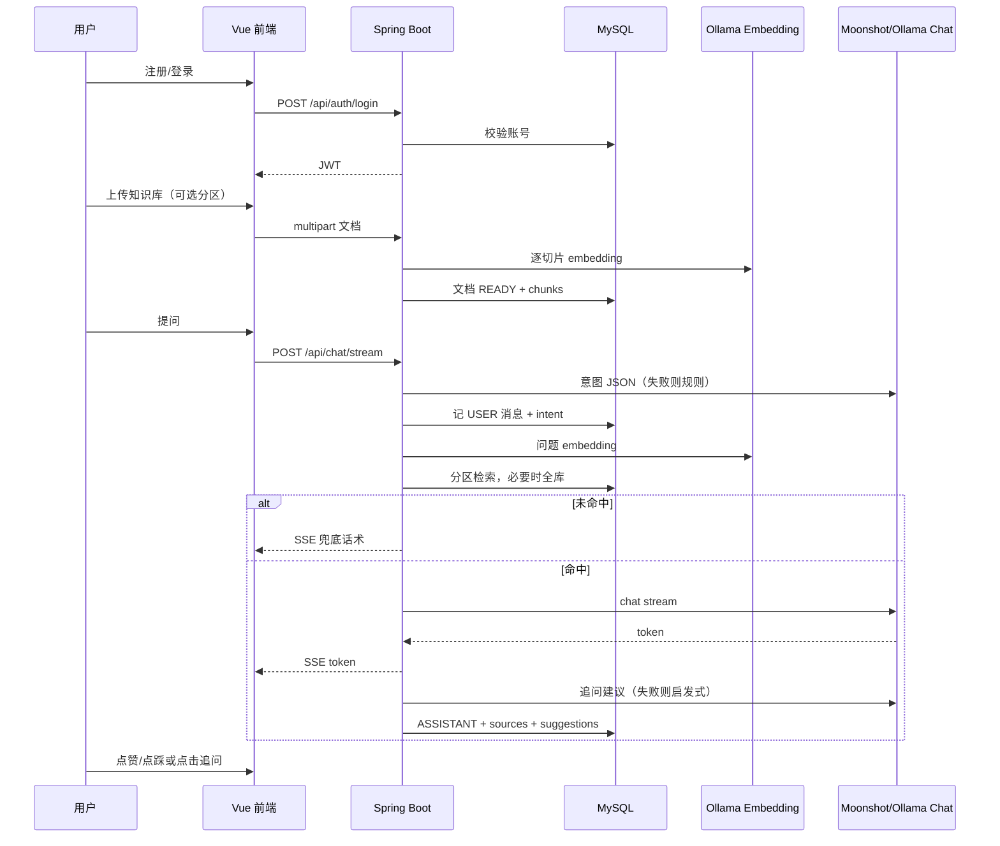

# 业务流程说明

```mermaid
sequenceDiagram
    participant U as 用户
    participant FE as Vue 前端
    participant API as Spring Boot
    participant DB as MySQL
    participant EMB as Ollama Embedding
    participant LLM as Moonshot/Ollama Chat

    U->>FE: 注册/登录
    FE->>API: POST /api/auth/login
    API->>DB: 校验账号
    API-->>FE: JWT

    U->>FE: 上传知识库（可选分区）
    FE->>API: multipart 文档
    API->>EMB: 逐切片 embedding
    API->>DB: 文档 READY + chunks

    U->>FE: 提问
    FE->>API: POST /api/chat/stream
    API->>LLM: 意图 JSON（失败则规则）
    API->>DB: 记 USER 消息 + intent
    API->>EMB: 问题 embedding
    API->>DB: 分区检索，必要时全库
    alt 未命中
        API-->>FE: SSE 兜底话术
    else 命中
        API->>LLM: chat stream
        LLM-->>API: token
        API-->>FE: SSE token
        API->>LLM: 追问建议（失败则启发式）
        API->>DB: ASSISTANT + sources + suggestions
    end
    U->>FE: 点赞/点踩或点击追问
```

前端用 `fetch` 读 SSE：`meta` 带来源与意图，`done` 带 `messageId` 与 `suggestions`。
