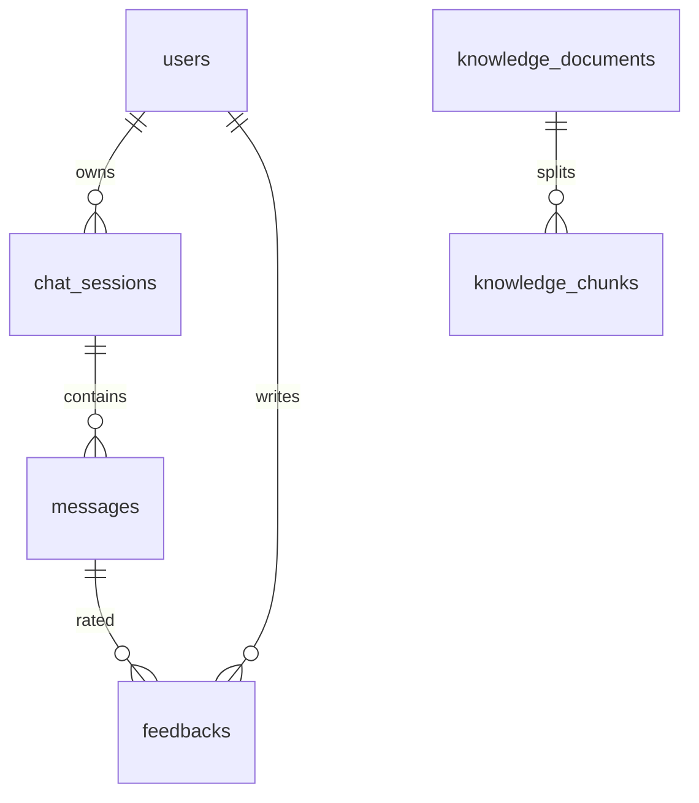

# 数据库设计

## ER 关系

## 表说明

### users
用户账号。`email`、`phone` 均可空，但至少有一个；各自唯一。密码存 BCrypt 哈希。

### chat_sessions
一次独立对话。`title` 取首条用户问题前 20 字。

### messages
`role`：`USER` / `ASSISTANT`。`sources_json` 存本轮 RAG 引用（文档名 + 摘要 + 分数），与向量切片解耦，历史回答可复现当时引用。

### feedbacks
对 AI 消息的点赞/点踩，`(message_id, user_id)` 唯一，重复提交覆盖。

### knowledge_documents
知识库文件元数据。`status`：`PROCESSING` / `READY` / `FAILED`。

### knowledge_chunks
切分后的文本与 embedding JSON。删除文档时 CASCADE 删除切片，保证向量与元数据一致。

## 设计要点

- 向量不另起服务：体量小，用库内存储 + 进程内余弦计算即可。
- 消息与切片分离：即使后来删除知识库，历史会话里仍能看到当时引用摘要。
