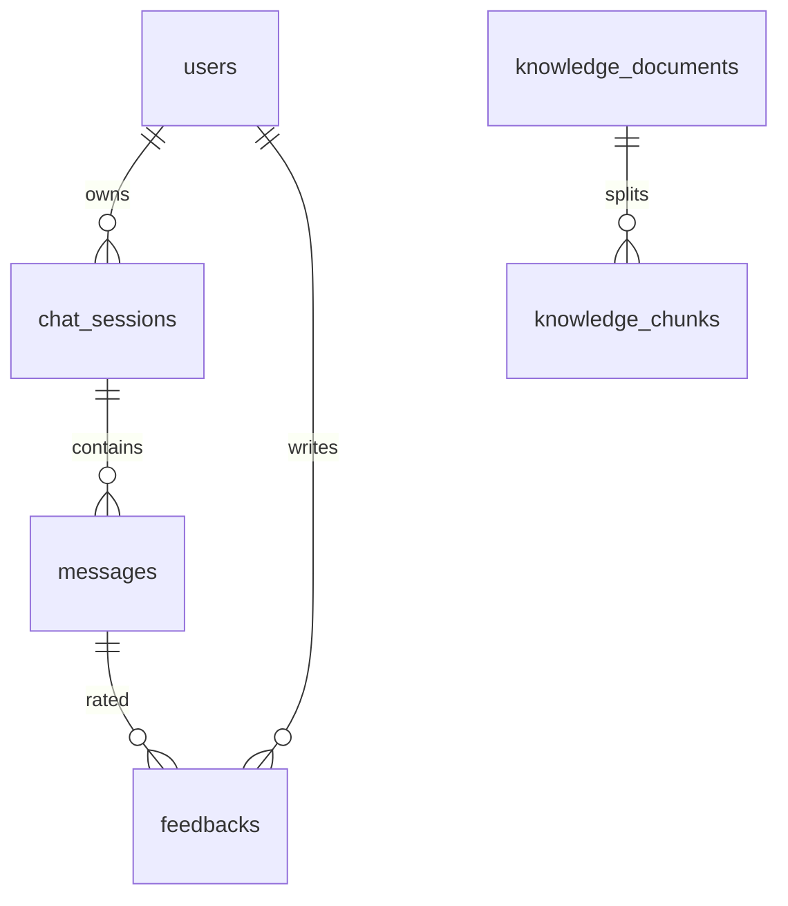

# 数据库设计

## ER 关系

## 表结构说明

### users
| 字段 | 说明 |
|---|---|
| email / phone | 可空但至少一项，各自唯一 |
| password_hash | BCrypt |
| role | `USER` / `ADMIN` |

### chat_sessions
一次独立对话。`title` 取首条用户问题前 20 字。`user_id` 外键关联用户。

### messages
| 字段 | 说明 |
|---|---|
| role | `USER` / `ASSISTANT` |
| content | 正文 |
| sources_json | RAG 引用或 `{sources,suggestions}` 包装 JSON |
| intent | 用户消息意图码（如 `AFTER_SALES`），助手消息可空 |

### feedbacks
对 AI 消息的点赞/点踩。`(message_id, user_id)` 唯一，重复提交覆盖。`type`：`LIKE` / `DISLIKE`。

### knowledge_documents
| 字段 | 说明 |
|---|---|
| filename / content_type | 文件元数据 |
| kb_collection | 分区：`PRODUCT` / `AFTER_SALES` / `FAQ` / `GENERAL` |
| status | `PROCESSING` / `READY` / `FAILED` |
| error_message | 失败原因 |

### knowledge_chunks
切分文本 + `embedding_json`（向量数组 JSON）。`document_id` 外键，`ON DELETE CASCADE`，删文档时同步清向量。

## 设计要点

- **向量与消息解耦**：引用摘要存在 `messages.sources_json`，即使后来删除知识库，历史回答仍可展示当时依据。  
- **小语料不做独立向量服务**：embedding 存 MySQL，检索时进程内余弦；生产可替换存储引擎。  
- **建表脚本**：`backend/数据库初始化脚本/init.sql`；线上/本地开发亦可用 Flyway（`db/migration`）。
