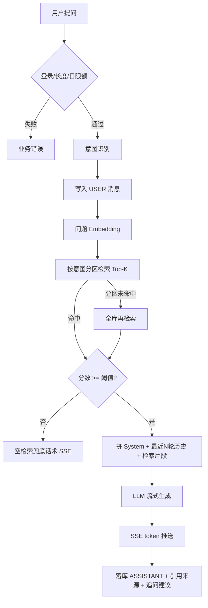

# 智云客服

基于 **Java Spring Boot 3 + Vue 3 + MySQL** 的企业知识库智能客服。对话可用 **月之暗面 API** 或本机 **Ollama**；检索优先 **Ollama nomic-embed-text**。

## 技术选型及原因

| 层 | 选择 | 原因 |
|---|---|---|
| 后端 | Spring Boot 3 / Java 17 | 企业后端常用栈；SSE、JPA、Security 开箱即用 |
| 前端 | Vue 3 + TypeScript + Vite | 题目二选一 |
| 对话 LLM | Moonshot `kimi-k2.6`（可切 Ollama qwen2） | 云端稳定；本机 GPU 不可用时仍能演示 |
| Embedding | 默认 Ollama `nomic-embed-text`；不可用则本机词法向量 | 题目要求语义向量；Moonshot Embedding 多数 Key 未开通（403） |
| 向量存储 | **Qdrant**（Docker 生产）+ MySQL 向量备份 | 题目常见方案；进程挂了向量仍在。未配 Qdrant 时用内存余弦，Qdrant 故障同样回退 |
| 关系库 | MySQL 8 | 题目指定 |

未使用 LangChain：切分、向量化、Top-K、拼 Prompt、流式调用均在业务代码中显式实现，便于说明每一步原理。

## 整体 AI 架构图（RAG 链路）

从用户提问到返回答案的每一步：

更细的时序图见 `docs/业务流程说明.md`，设计决策见 `docs/AI架构设计.md`。

## 业务思考：AI 特有工程问题

- **检索为空**：不调用对话模型，返回标准兜底（或投诉安抚话术），避免编造政策。
- **上下文超长**：只携带最近 N 轮（默认 3）历史；检索只取 Top-K 片段。
- **LLM 幻觉**：System Prompt 要求只依据检索结果；空检索短路；前端展示「参考资料」便于核对。
- **意图/模型失败**：短超时 JSON 分类失败则规则回退；Embedding/对话有备用路径。

## 使用的 AI 工具（必须说明）

| 类型 | 工具 | 用途 |
|---|---|---|
| 编程助手 | Cursor | 辅助生成样板代码与页面，再人工审阅、改错、补业务约束 |
| 对话 LLM | 月之暗面 Moonshot（`kimi-k2.6`） | 流式回答；意图/追问短补全 |
| 备用对话 | 本机 Ollama（`qwen2`） | 云端不可用时回退 |
| Embedding | Ollama `nomic-embed-text` | 切片与问题向量化（优先） |
| Embedding 回退 | 本机词法哈希向量 | 无 Ollama 时保证链路可跑 |

未把真实 API Key 写入仓库；使用根目录 `.env`（gitignore）与 `.env.example`。

## 构建 RAG 时对 AI 生成代码做的优化与修正

1. 空检索短路，不调对话模型。  
2. 相似度阈值 + 短问关键词兜底。  
3. SSE 用具名事件；前端 `fetch` 带 JWT（不用 EventSource）。  
4. 历史截断为最近 N 轮。  
5. System Prompt 禁止编造政策价格。  
6. Embedding 后端进程内锁定，维数变化时启动重嵌。  
7. 停止生成可中断并落库。  
8. 意图/追问 LLM 失败时规则/启发式降级。

## 如何评估与验证 RAG 回答质量

以人工场景测试为主，详见下表；并结合管理后台意图/反馈统计核对。

| 用例 | 示例 | 期望 |
|---|---|---|
| 命中 | 专业版多少钱 / 7 天退款 | 有正确参考资料 |
| FAQ | 忘记密码怎么办 | 步骤与文档一致 |
| 空检索 | 今天股市怎么样 | 兜底，不编造 |
| 闲聊/转人工 | 你好 / 转人工 | 固定话术 |
| 多轮 | 先问套餐再问企业版 | 能承接指代 |
| 流式 | 任意命中问题 | 先 meta 后 token |

## 扩展能力（加分项）

意图识别、追问建议、管理后台、多知识库分区路由——均已实现。
